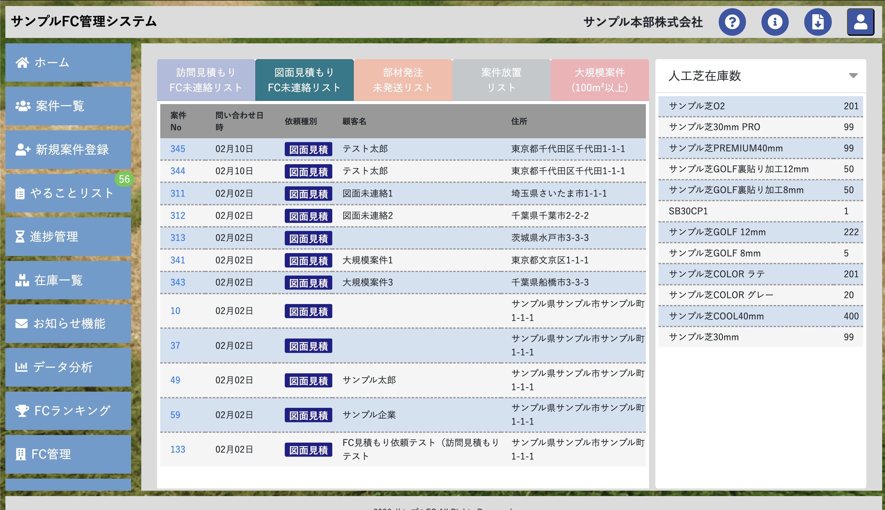

# Laravel Sales Management System

## 🎯 Project Overview

A comprehensive **Sales Management System** built with **Laravel 11** for managing franchise operations, quotations, orders, and customer relationships. This enterprise-level application demonstrates full-stack PHP development capabilities with complex business logic implementation.



## 👨‍💻 About This Project

This is a **real-world production system** I developed and maintained as a full-stack PHP developer. The project showcases my ability to:

- Build scalable enterprise applications with Laravel
- Design and implement complex database architectures
- Create intuitive user interfaces with responsive design
- Integrate third-party APIs (Freee Accounting, AWS S3, Slack)
- Write maintainable, well-documented code following PSR standards

## 🚀 Key Features

### Core Functionality
- **Franchise Management**: Multi-tenant system supporting franchise operations
- **Customer Relationship Management**: Lead tracking, customer segmentation, and history
- **Quotation System**: Generate detailed quotations with PDF export
- **Order Management**: Complete order lifecycle from creation to fulfillment
- **Invoice & Payment Processing**: Automated billing and payment tracking
- **Analytics & Reporting**: Business intelligence dashboard with insights
- **User & Role Management**: Granular permission system for different user types

### Technical Highlights
- **RESTful API Design**: Clean, well-structured endpoints
- **Database Optimization**: Efficient queries with proper indexing
- **File Management**: AWS S3 integration for document storage
- **Email Automation**: Automated notifications and reminders
- **Real-time Notifications**: Slack integration for team communication
- **Responsive Design**: Mobile-first approach using Bootstrap 4
- **Security**: CSRF protection, XSS prevention, input validation

## 🛠 Technology Stack

### Backend
- **PHP 8.2+** - Modern PHP with strict typing
- **Laravel 11** - Elegant MVC framework
- **MySQL** - Relational database
- **Composer** - Dependency management

### Frontend
- **Bootstrap 4** - Responsive UI framework
- **jQuery** - DOM manipulation and AJAX
- **JavaScript ES6+** - Modern JavaScript features
- **Sass** - CSS preprocessing

### DevOps & Tools
- **Docker** - Containerization for development
- **Git** - Version control
- **PHPUnit** - Unit testing
- **Laravel Dusk** - Browser testing

- **Intervention Image v3** - Image processing
- **Freee Accounting API** - Accounting system integration
- **Slack API** - Team notifications
- **DomPDF** - PDF generation

## 📊 Database Architecture

The system features a robust database design with **47+ tables** including:
- Users & Authentication
- Contacts & Customers
- Products & Inventory
- Quotations & Orders
- Transactions & Payments
- Analytics & Logs

## 💼 Skills Demonstrated

### PHP & Laravel Expertise
- ✅ MVC architecture implementation
- ✅ Eloquent ORM and Query Builder
- ✅ Database migrations and seeders
- ✅ Service providers and dependency injection
- ✅ Custom middleware and request validation
- ✅ Job queues and scheduled tasks
- ✅ API development and integration

### Database & Performance
- ✅ Complex SQL queries and relationships
- ✅ Database indexing and optimization
- ✅ N+1 query prevention
- ✅ Caching strategies

### Frontend Development
- ✅ Responsive design implementation
- ✅ AJAX and asynchronous operations
- ✅ Form validation and UX optimization
- ✅ Component-based architecture

### Software Engineering
- ✅ Clean code principles
- ✅ SOLID design patterns
- ✅ Test-driven development (TDD)
- ✅ Code documentation
- ✅ Git workflow and version control

## 🔧 Installation & Setup

### Laravel Sail (Docker) Environment

This project uses Laravel Sail for a simple, portable development environment.

**Prerequisites**
- Docker Desktop
- PHP & Composer (locally) OR use the `sail` alias if PHP is not installed locally.

**Installation Steps**

1.  **Clone the repository**
    ```bash
    git clone <repository-url>
    cd sales-management-laravel
    ```
2.  **Install Dependencies**
    ```bash
    composer install
    ```
3.  **Configure Environment**
    ```bash
    cp .env.example .env
    # Sail uses .env variables to configure Docker containers
    ```
4.  **Start Sail**
    ```bash
    ./vendor/bin/sail up -d
    ```
5.  **Setup Application**
    ```bash
    ./vendor/bin/sail artisan key:generate
    ./vendor/bin/sail artisan migrate:fresh --seed
    ```
6.  **Build Frontend**
    ```bash
    ./vendor/bin/sail npm install
    ./vendor/bin/sail npm run dev
    ```

**Accessing the Application**

-   **Web App**: `http://localhost`
-   **Mailpit** (Email Testing): `http://localhost:8025`
-   **MySQL**: Port `3306`
-   **Redis**: Port `6379`

### Default Login Credentials

The `migrate:fresh --seed` command sets up the following test users.
**All passwords are:** `password`

| User Type | Email | Password |
| :--- | :--- | :--- |
| **Admin (本部)** | `admin@example.com` | `password` |
| **FC (店舗)** | `user2@example.com` | `password` |
| **FC (その他)** | `user3@example.com` | `password` |

*Note: For more users, check `database/seeds/UsersTableSeeder.php`.*

## 📁 Project Structure

```
├── app/
│   ├── Http/Controllers/    # Business logic controllers
│   ├── Models/              # Eloquent models
│   ├── Mail/                # Email templates
│   └── helpers.php          # Custom helper functions
├── database/
│   ├── migrations/          # Database schema
│   └── seeds/               # Sample data
├── resources/
│   ├── views/               # Blade templates
│   └── sass/                # SCSS files
├── routes/
│   ├── web.php             # Web routes
│   └── api.php             # API routes
├── tests/                   # PHPUnit & Dusk tests
└── config/                  # Configuration files
```

## 🧪 Testing

Run unit tests:
```bash
php artisan test
```

### Playwright E2E Tests

This project uses **Playwright** for End-to-End (E2E) testing.

**Prerequisites**

- Node.js (Latest LTS version recommended)
- NPM

**Installation**

1.  Install dependencies:
    ```bash
    npm install
    # or
    npm ci
    ```

2.  Install Playwright browsers:
    ```bash
    npx playwright install
    ```

**Running Tests**

Run all E2E tests:
```bash
npx playwright test
```

Run specific test file:
```bash
npx playwright test tests/e2e/user_flow.spec.js
```

**Viewing Reports**

View the HTML report of the last test run:
```bash
npx playwright show-report
```

## 📝 Code Quality

This project follows:
- **PSR-2** coding standards
- **PSR-4** autoloading
- Laravel best practices
- Clean code principles

## 🌟 Why This Project Stands Out

1. **Production-Ready**: This is not a tutorial project - it's a real system handling actual business operations
2. **Complex Business Logic**: Implements sophisticated workflows for franchise management
3. **Scalable Architecture**: Designed to handle growing data and user base
4. **Modern PHP**: Uses PHP 8.0+ features and best practices
5. **Well-Documented**: Clean, readable code with comprehensive documentation

## 📧 Contact

**Available for:**
- Full-stack Laravel development
- PHP backend development
- API development and integration
- Database design and optimization
- Legacy code refactoring
- Technical consulting

**Upwork Profile**: [Your Upwork Profile URL]

---

## 📄 License

This is a portfolio project. All proprietary business logic and sensitive information have been removed or anonymized.

---

⭐ **Looking for a skilled Laravel developer?** Check out my other projects or reach out for collaboration!
